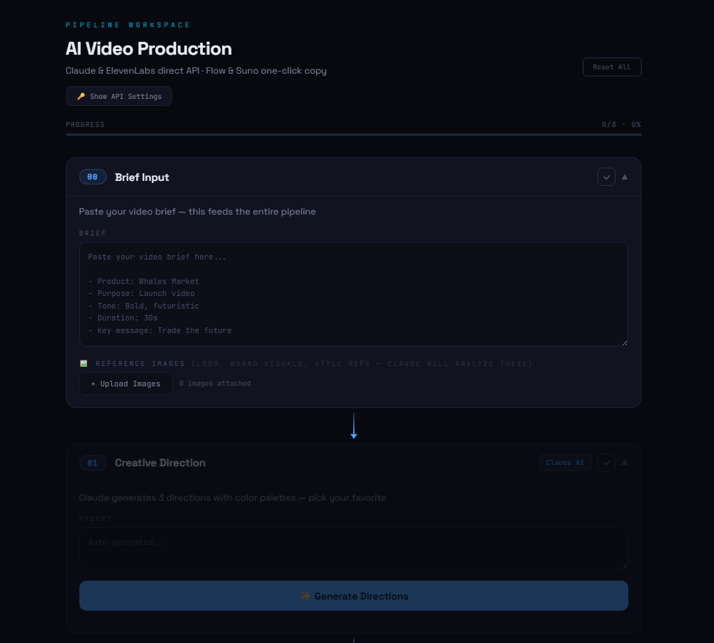

# 🎬 AI Video Production Pipeline

> **Designer × AI = Creative Director** — Turn a brief into a complete 30s video in under 1 hour.

<div align="center">

<br><br>

| ⏱️ Before: **2–4 weeks** (5-7 people) | ⚡ After: **< 1 hour** (1 person + AI) |
|:---:|:---:|

</div>

---

## What is this?

A single HTML file that connects **5 AI tools** into one automated video production pipeline:

```
00 Brief Input          → Paste brief + upload brand images
01 Creative Direction   → 3 directions with color palettes         🤖 Claude API
02 Script & Storyboard  → Formatted table + revision loop          🤖 Claude API
03 Generate Prompts     → Auto-generates Veo + VO + Suno prompts   🤖 Claude API
4A Video Clips          → Per-shot cards, copy & open Flow         📋 Google Flow
4B Voice-Over           → Generate audio directly in workspace     🎤 ElevenLabs API
4C Music                → Per-track cards, copy & open Suno        📋 Suno
05 Compile & Polish     → Auto-generate After Effects .jsx script  ⚡ After Effects
```

---

## Key Features

- 🔗 **Direct API** — Claude + ElevenLabs called directly from browser, no backend needed
- 🎬 **Per-Shot / Per-Track Cards** — Each shot & track gets its own copy button
- 🎯 **Smart Auto-fill** — Step 03 done → prompts auto-fill into 4A, 4B, 4C
- 🔄 **Script Revision Loop** — Type feedback → Claude rewrites → iterate endlessly
- 🎨 **Veo 3 Optimized** — Prompts follow best practices with consistency anchors
- ⚡ **AE Auto-Assembly** — 1 click generates .jsx → import, timeline, transitions, text overlays
- 🖼️ **Vision Analysis** — Upload brand images → Claude analyzes → informs direction

---

## Quick Start

1. Open `pipeline-workspace.html` in Chrome
2. Enter API keys (Claude + ElevenLabs) in Settings
3. Paste brief → hit Generate on each step → done

---

<div align="center">

*Built with 🐋 for Become Creative Director — Cook Series*

</div>
